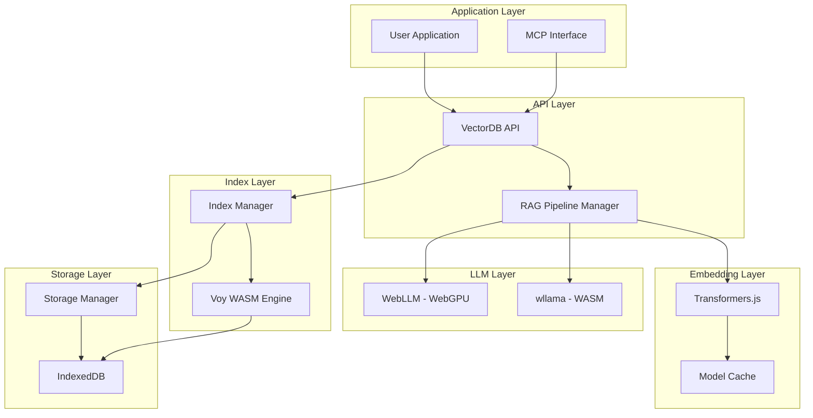

<div align="center">

<br>


**Your Private AI Stack**

Vector database + RAG + LLM—all in the browser

</div>

---

## Why VgRAG?

Build RAG applications without cloud dependencies. All processing happens client-side using WebAssembly and WebGPU.

- 🔒 **Private**: Data never leaves the browser
- ⚡ **Fast**: WebGPU acceleration with WASM fallback
- 💰 **Free**: Zero cloud costs, no API keys
- 📦 **Complete**: Vector DB + embeddings + LLM + RAG
- 🌐 **Offline**: Works without internet after initial load

## Quick Start

```bash
npm install vg-rag
```

```typescript
import VgRag from 'vg-rag';

// Create database
const db = new VgRag({
  storage: { dbName: 'my-app' },
  index: { dimensions: 384, metric: 'cosine' },
  embedding: { model: 'Xenova/all-MiniLM-L6-v2', device: 'wasm' },
});

await db.initialize();

// Add documents
await db.insert({
  text: 'Vg-RAG is a privacy-first vector database for browsers',
  metadata: { category: 'intro' },
});

// Semantic search
const results = await db.search({
  text: 'What is Vg-RAG?',
  k: 5,
});

console.log(results);
```

## Features

- **Vector Search**: Store and search 100K+ documents with semantic understanding
- **Local Embeddings**: Transformers.js integration with WebGPU acceleration
- **Private RAG**: Complete retrieval-augmented generation pipeline
- **Dual LLM Support**: WebLLM (WebGPU) + Wllama (WASM) with automatic fallback
- **MCP Integration**: Works with Claude Desktop and AI agent ecosystems
- **Easy Integration**: Clean TypeScript API with full type safety

## Use Cases

**Privacy-Critical Applications**
- Legal tech, healthcare, finance
- GDPR-compliant by design
- Attorney-client privilege protection

**Offline-First Apps**
- Browser extensions
- Electron applications
- Progressive web apps

**Cost-Sensitive Projects**
- Zero cloud infrastructure costs
- No API rate limits
- Unlimited usage

## Core Features

### Vector Search
```typescript
// Semantic search with metadata filtering
const results = await db.search({
  text: 'machine learning concepts',
  k: 10,
  filter: { field: 'category', operator: 'eq', value: 'AI' },
});
```

### RAG Pipeline
```typescript
import { RAGPipelineManager, WllamaProvider } from 'vg-rag';

// Setup RAG with local LLM
const llm = new WllamaProvider({ model: '...' });
const rag = new RAGPipelineManager(db, llm, embedding);

// Ask questions with context
const result = await rag.query('What is machine learning?', {
  topK: 3,
  generateOptions: { maxTokens: 256, temperature: 0.7 },
});

console.log(result.answer);
console.log(result.sources); // Citations
```

### MCP Integration
```typescript
import { MCPServer } from 'vg-rag';

// Expose as MCP tools for AI agents
const mcp = new MCPServer(db, rag);

// Use with Claude Desktop, ChatGPT, etc.
const tools = mcp.getTools();
```

## Documentation

### Getting Started
- **[Quickstart Guide](./docs/QUICKSTART.md)** - Get up and running in 5 minutes
- **[API Reference](./docs/API.md)** - Complete API documentation
- **[Examples](./examples/README.md)** - Code examples and demos

### Tutorials
- **[RAG Pipeline Tutorial](./docs/RAG_TUTORIAL.md)** - Build RAG applications
- **[MCP Integration Guide](./docs/MCP_INTEGRATION.md)** - Integrate with AI assistants

### Advanced
- **[Performance Tuning](./docs/PERFORMANCE.md)** - Optimize for production
- **[Troubleshooting](./docs/TROUBLESHOOTING.md)** - Common issues and solutions
- **[Testing Guide](./docs/TESTING.md)** - Testing strategies

## Architecture

vg-rag combines multiple technologies into a cohesive stack:

- **Storage**: IndexedDB for persistent vector storage
- **Indexing**: Voy (WASM) for fast k-d tree search
- **Embeddings**: Transformers.js with WebGPU/WASM
- **LLMs**: WebLLM (WebGPU) and Wllama (WASM)
- **Protocol**: MCP for AI agent integration

All components run entirely in the browser with zero server dependencies.

### High-Level Architecture Diagram



## Performance

| Operation | Latency | Throughput |
|-----------|---------|------------|
| Search (10K vectors) | <50ms | - |
| Insert (batch) | - | 2000+ docs/sec |
| Embedding generation | 50-200ms | - |
| RAG query (full) | 500ms-5s | - |

*Benchmarks on Chrome 120, M1 MacBook Pro*

## Production Use

Vg-RAG powers privacy-tier features at [Lexemo](https://lexemo.com), processing sensitive legal documents for EU law firms without cloud transmission.

## Development

```bash
# Install dependencies
npm install

# Run tests
npm test

# Run tests in watch mode
npm run test:watch

# Run integration tests (requires network)
npm run test:integration

# Build library
npm run build

# Type check
npm run type-check

# Run benchmarks
npm run benchmark
```

## Browser Support

- **Chrome/Edge**: 90+ (WebGPU: 113+)
- **Firefox**: 88+ (WebGPU: Not yet supported)
- **Safari**: 14+ (WebGPU: Not yet supported)

**Requirements:**
- IndexedDB support
- WebAssembly support
- ES2020+ JavaScript

**Optional:**
- WebGPU for accelerated inference
- SharedArrayBuffer for multi-threading

## Roadmap

- [ ] Python bindings (PyScript)
- [ ] React hooks package
- [ ] Hybrid search (dense + sparse)
- [ ] Multi-modal embeddings (CLIP)
- [ ] Quantization in browser

## Contributing

Contributions welcome! Please open an issue or PR.

## License

MIT © 2024

---

<div align="center">

Built with ❤️ for privacy-conscious developers

</div>
